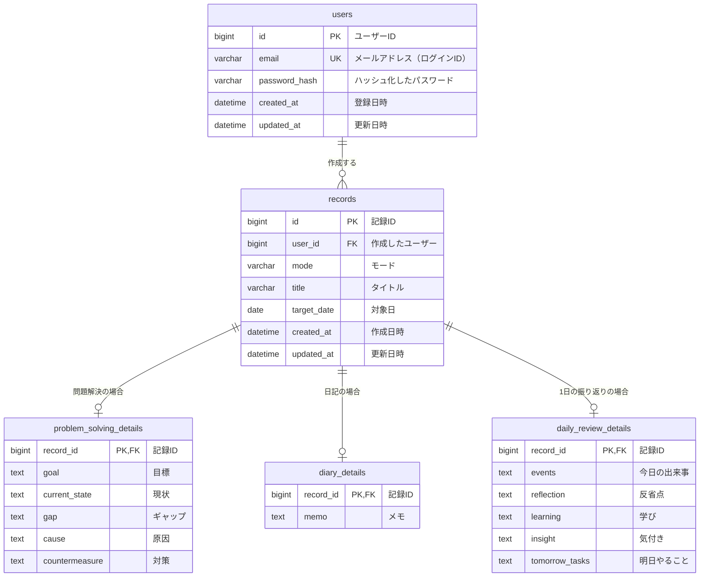

# MindLog ER図

## 0. 文書情報

| 項目 | 内容 |
|---|---|
| 文書名 | MindLog 基本設計書：ER図 |
| バージョン | v1.0 |
| 作成日 | 2026-10-08 |
| ステータス | 確定 |
| 関連文書 | [要件定義書](../requirements/requirements.md)、[画面遷移図](screen-transition.md) |

本図は基本設計として、エンティティ（テーブル）・属性（カラム）・リレーションを定める。データ型・桁数・インデックス等の詳細はDB設計で確定する（本図の型は目安）。

### テーブル構成の方針

記録は「共通項目を持つテーブル」＋「モード別の入力項目を持つテーブル」に分割する（共通＋モード別方式）。要件定義書「10. モード間の関係」の、3つのモードを独立した記録方式として扱う考え方に合わせる。

---

## 1. ER図

---

## 2. エンティティ定義

### 2.1 users（ユーザー）

| カラム | 論理名 | 必須 | 備考 | 関連要件 |
|---|---|---|---|---|
| id | ユーザーID | ○ | 主キー。自動採番 | - |
| email | メールアドレス | ○ | 一意（重複不可）。ログインIDとして使用 | FR-001, FR-002 |
| password_hash | パスワード | ○ | ハッシュ化して保存（平文は保存しない） | NFR-001 |
| created_at | 登録日時 | ○ | | - |
| updated_at | 更新日時 | ○ | | - |

### 2.2 records（記録：共通項目）

| カラム | 論理名 | 必須 | 備考 | 関連要件 |
|---|---|---|---|---|
| id | 記録ID | ○ | 主キー。自動採番 | - |
| user_id | ユーザーID | ○ | users.id を参照する外部キー | FR-026, FR-027 |
| mode | モード | ○ | 問題解決／日記／1日の振り返りのいずれか | FR-009, FR-021 |
| title | タイトル | - | 未入力可（表示時は「（無題）」） | FR-024, 要件定義書7節 |
| target_date | 対象日 | ○ | 作成日時とは別に管理。初期値は作成日 | FR-011, FR-022 |
| created_at | 作成日時 | ○ | | FR-012 |
| updated_at | 更新日時 | ○ | 一覧・ダッシュボードの並び順に使用 | FR-013, FR-017, FR-018 |

### 2.3 problem_solving_details（問題解決モードの入力項目）

| カラム | 論理名 | 必須 | 備考 | 関連要件 |
|---|---|---|---|---|
| record_id | 記録ID | ○ | 主キー兼 records.id を参照する外部キー | FR-006 |
| goal | 目標 | - | | FR-006 |
| current_state | 現状 | - | | FR-006 |
| gap | ギャップ | - | | FR-006 |
| cause | 原因 | - | | FR-006 |
| countermeasure | 対策 | - | | FR-006 |

### 2.4 diary_details（日記モードの入力項目）

| カラム | 論理名 | 必須 | 備考 | 関連要件 |
|---|---|---|---|---|
| record_id | 記録ID | ○ | 主キー兼 records.id を参照する外部キー | FR-007 |
| memo | メモ | - | | FR-007 |

### 2.5 daily_review_details（1日の振り返りモードの入力項目）

| カラム | 論理名 | 必須 | 備考 | 関連要件 |
|---|---|---|---|---|
| record_id | 記録ID | ○ | 主キー兼 records.id を参照する外部キー | FR-008 |
| events | 今日の出来事 | - | | FR-008 |
| reflection | 反省点 | - | | FR-008 |
| learning | 学び | - | | FR-008 |
| insight | 気付き | - | | FR-008 |
| tomorrow_tasks | 明日やること | - | | FR-008 |

記録の入力項目は要件定義書7節に従い、すべて任意入力（未入力可）とする。

---

## 3. リレーション

| 関係 | 多重度 | 説明 |
|---|---|---|
| users — records | 1 対 0..N | 1人のユーザーは0件以上の記録を持つ。記録は必ず1人のユーザーに属する（FR-026） |
| records — 各モード別テーブル | 1 対 0..1 | 1件の記録は、records.mode に対応するモード別テーブルにのみ1行を持つ |

ER図だけでは「modeに対応するテーブルにだけ1行を持つ」ことを表現できないため、この整合性はアプリケーション側で保証する。

---

## 4. 基本設計で決定した事項

| No. | 項目 | 決定内容 |
|---|---|---|
| 1 | モードの持ち方 | records.mode に文字列コード（`PROBLEM_SOLVING` / `DIARY` / `DAILY_REVIEW`）を持たせる。モード用のマスタテーブルは作らない（モードは3つで固定のため） |
| 2 | モード別テーブルの主キー | records.id をそのまま主キー兼外部キーとして使う（共有主キー）。モード別テーブル独自のIDは持たない |
| 3 | 記録削除時の扱い | 物理削除（DBから行を消す）とし、records を削除したら対応するモード別テーブルの行も一緒に削除する |
| 4 | ユーザー削除時の扱い | アカウント削除機能はスコープ外のため、初期実装では考慮しない |
