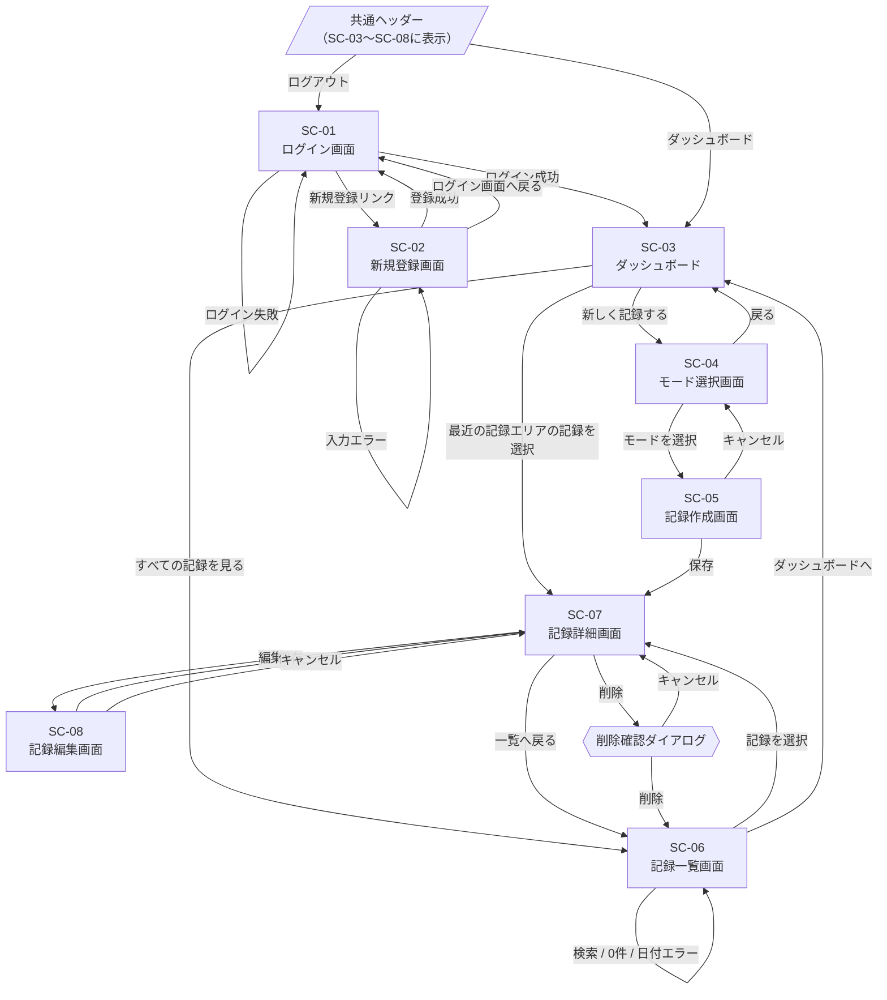

# MindLog 画面遷移図

## 0. 文書情報

| 項目 | 内容 |
|---|---|
| 文書名 | MindLog 基本設計書：画面遷移図 |
| バージョン | v1.0 |
| 作成日 | 2026-10-07 |
| ステータス | 確定 |
| 関連文書 | [要件定義書](../requirements/requirements.md) |

本図は要件定義書「8. 画面一覧」「9. ユーザー操作フロー」をもとに、要件定義書に記載のない遷移を基本設計で補って作成した（[3. 基本設計で決定した事項](#3-基本設計で決定した事項)参照）。

---

## 1. 画面一覧

| ID | 画面名 | 認証 | 共通ヘッダー | 関連要件 |
|---|---|---|---|---|
| SC-01 | ログイン画面 | 不要 | なし | FR-001, FR-003 |
| SC-02 | 新規登録画面 | 不要 | なし | FR-002, FR-004 |
| SC-03 | ダッシュボード | 必要 | あり | FR-016, FR-017 |
| SC-04 | モード選択画面 | 必要 | あり | FR-009 |
| SC-05 | 記録作成画面 | 必要 | あり | FR-006〜FR-008, FR-011 |
| SC-06 | 記録一覧画面 | 必要 | あり | FR-018, FR-020〜FR-025 |
| SC-07 | 記録詳細画面 | 必要 | あり | FR-019 |
| SC-08 | 記録編集画面 | 必要 | あり | FR-014 |
| - | 削除確認ダイアログ | 必要 | - | FR-015 |

削除確認ダイアログは独立した画面ではなく、記録詳細画面上に表示するダイアログとして扱う。

---

## 2. 画面遷移図

### 共通の遷移

- 未ログイン状態で認証が必要な画面（SC-03〜SC-08）にアクセスした場合は、ログイン画面へ遷移する（FR-005）。
- ログイン後の全画面（SC-03〜SC-08）に共通ヘッダーを表示し、「ダッシュボード」「ログアウト」へのリンクを置く。ダッシュボードの「ログアウト」（FR-016）は共通ヘッダーで提供する。
- ログアウト後はログイン画面へ遷移する。

---

## 3. 基本設計で決定した事項

要件定義書に記載がなく、基本設計で決定した遷移・仕様。

| No. | 項目 | 決定内容 |
|---|---|---|
| 1 | ログイン画面 ⇔ 新規登録画面の行き来 | 相互にリンクを置く |
| 2 | ダッシュボードの「最近の記録」エリア（最新5件の一覧表示）に並ぶ各記録の選択 | 選択した記録の詳細画面へ遷移する |
| 3 | 記録一覧からの詳細表示 | 一覧の行（またはタイトル）を選択すると詳細画面へ遷移する |
| 4 | 作成・編集のキャンセル | 作成画面はモード選択画面へ、編集画面は詳細画面へ戻る（保存しない） |
| 5 | 戻る導線 | モード選択→ダッシュボード、一覧→ダッシュボード、詳細→一覧 |
| 6 | 共通ヘッダー | ログイン後の全画面（SC-03〜SC-08）に「ダッシュボード」「ログアウト」へのリンクを持つ共通ヘッダーを置く |
| 7 | ログアウト後の遷移先 | ログイン画面へ遷移する |
| 8 | 作成・編集画面で入力途中に離脱した場合の確認 | 確認ダイアログを出さない（下書き機能はスコープ外のため入力内容は破棄） |
